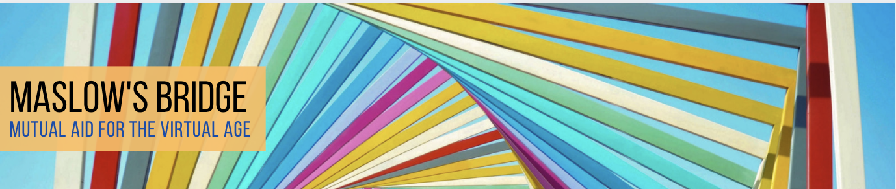
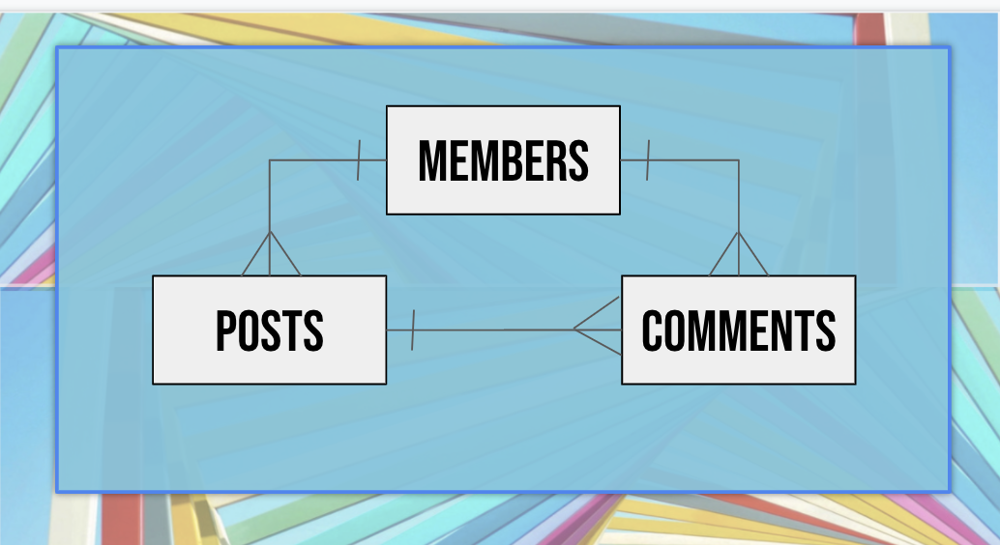

# by Tara Harwood, Full-Stack Software Development Student
# Flatiron School @ Denver

We are living through the Time of the Great Distancing.  While the COVID-19 pandemic is causing untold suffering around the world, our need to stay socially distant has damaged our need to stay socially connected.  People need support like never before, yet have limited access to the resources available in "normal" times.

At the same time, IRL and online communities are struggling to find ways to make enriching connections between members.  Many groups have some members who are in dire need of immediate assistance, while other members are well-resourced and looking for opportunties to support their communities?  How can they find each other?  Many communities have tried using Facebook Groups, but the thread-based system does not lend itself well to the task.

Maslow's Bridge is a white-labelled webapp designed specifically for online communities that want to foster a culture of mutual aid and social support among their members -- bridging the distance between needs and resources within private affinity groups.

Or ... you know, it could be that someday!  Right now it is just a sample Ruby project with no useful features and the interface of a 80's era BBS. Right now, the purpose of the project is to help me learn Ruby, and it is doing a great job of that!

